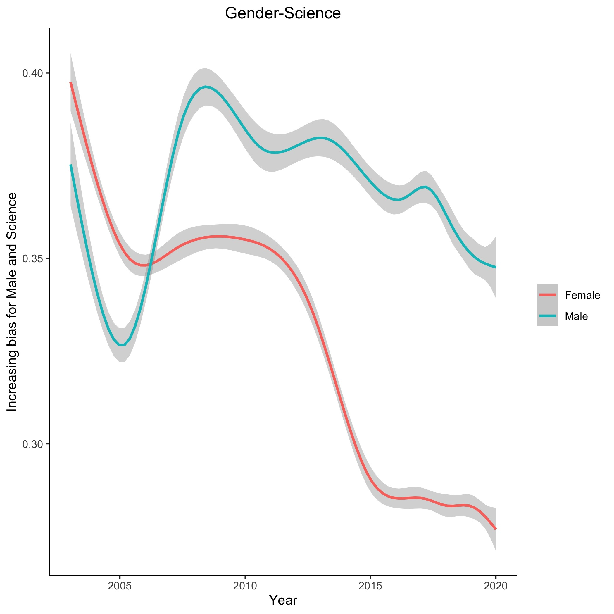

# IAT - Women in Science

An analysis of Harvard Implicit Association Test data centred around Women in Science. This was completed to provide supporting visualisations for a TU Delft exhibition and more context can be [found here](about).

Using R it was possible to plot the association of words relating to "Male" with "Science" and "Career", as opposed to pairing "Female" words with these or pairing "Male" words to words associated with "Arts" and "Family" respectively.

