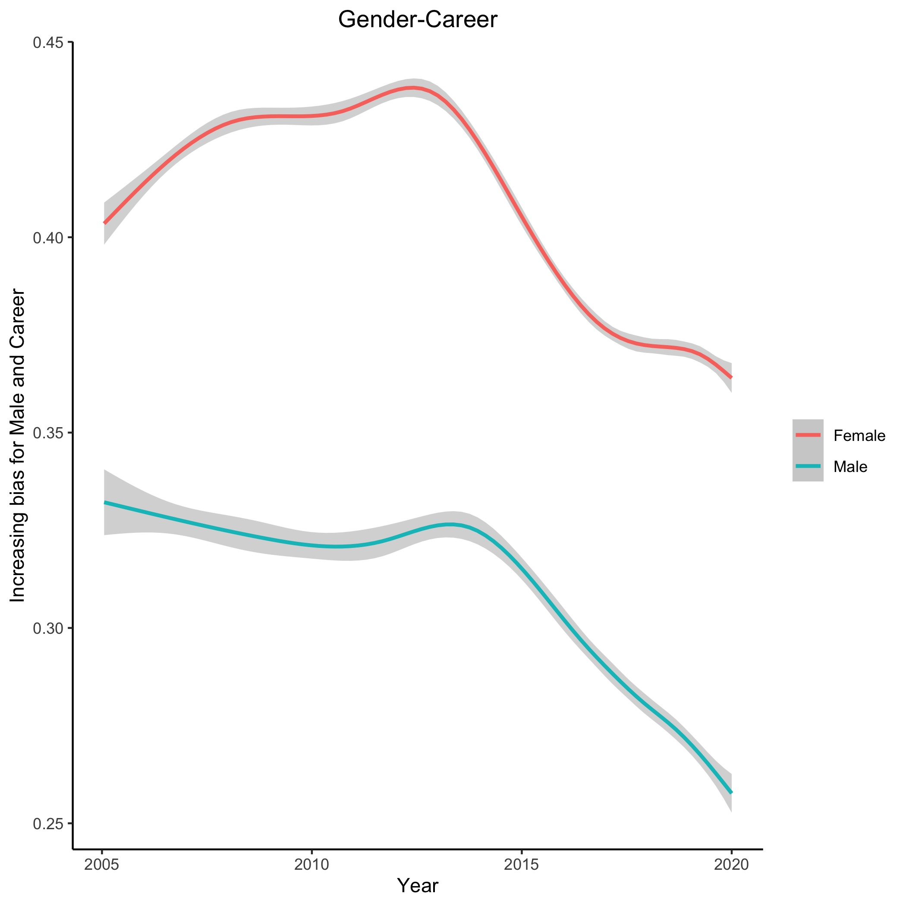
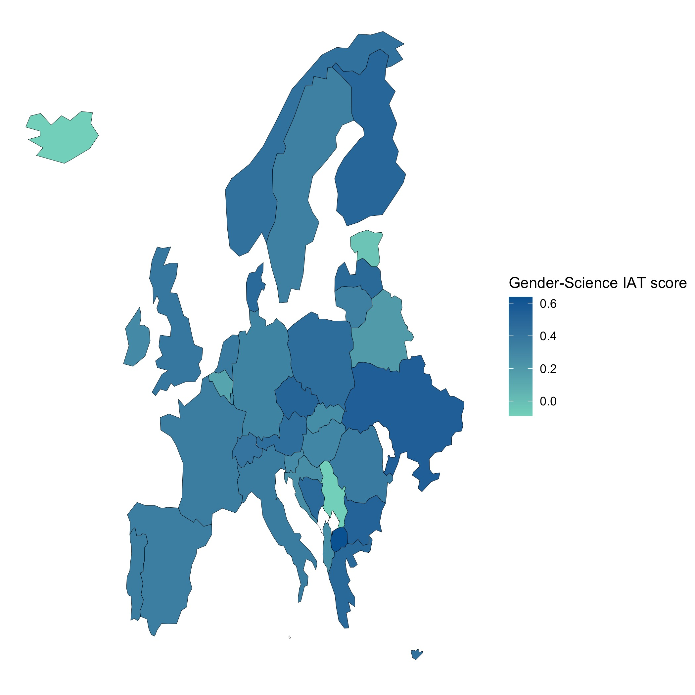
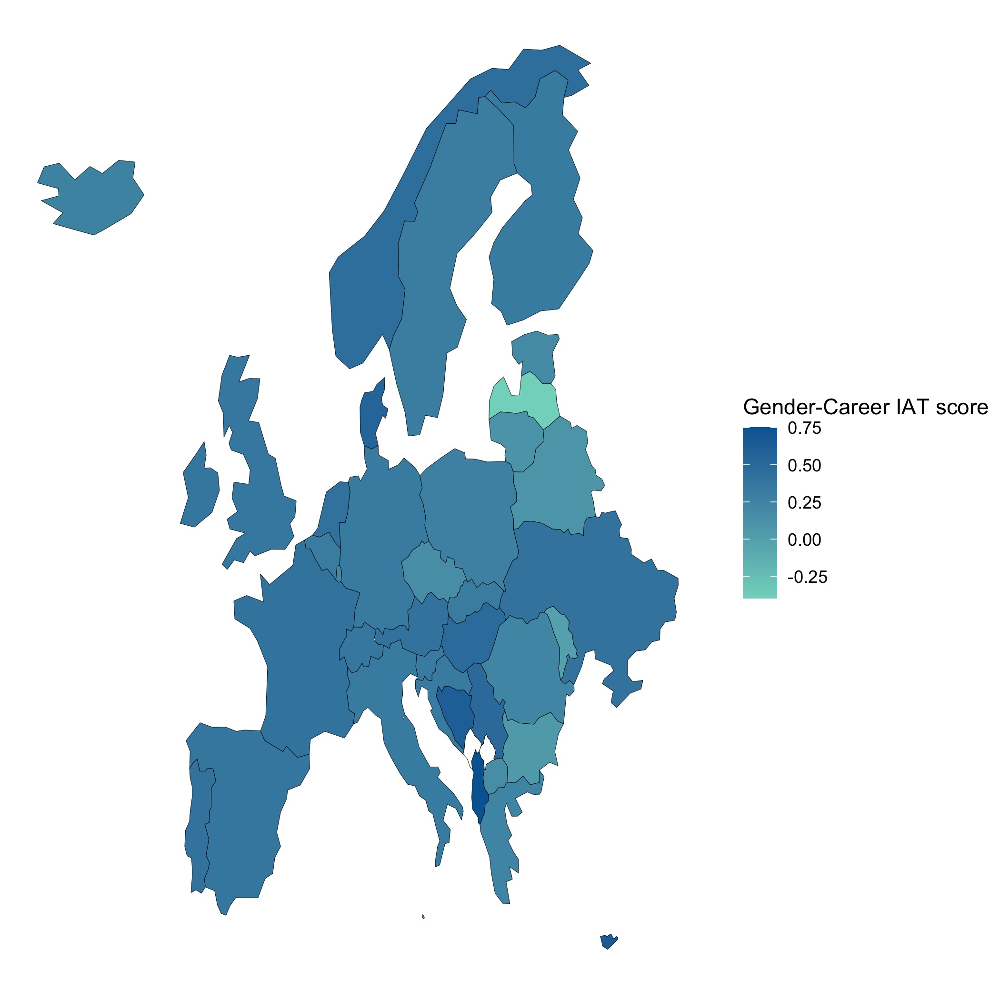

# IAT - Women in Science

An analysis of Harvard Implicit Association Test data centred around Women in Science. This was completed to provide supporting visualisations for a TU Delft exhibition and more context can be [found here](about).

Using R it was possible to plot the association of words relating to "Male" with "Science" and "Career", as opposed to pairing "Female" words with these or pairing "Male" words to words associated with "Arts" and "Family" respectively.

Bias could also be plotted across Europe, with increasing levels of association between words relating to "Male" and "Science" or "Career" being represented by darker colour.

Finally Sankey plots were made to identify which groups most contributed towards bias. A strong-weak bias was assigned according to Cohen (1977). Age and Gender were examined:

